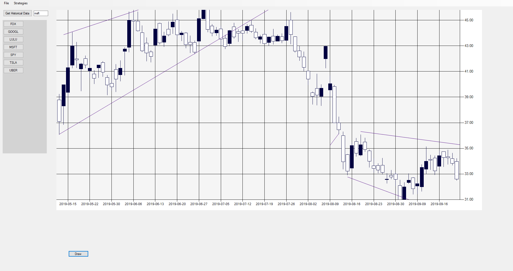
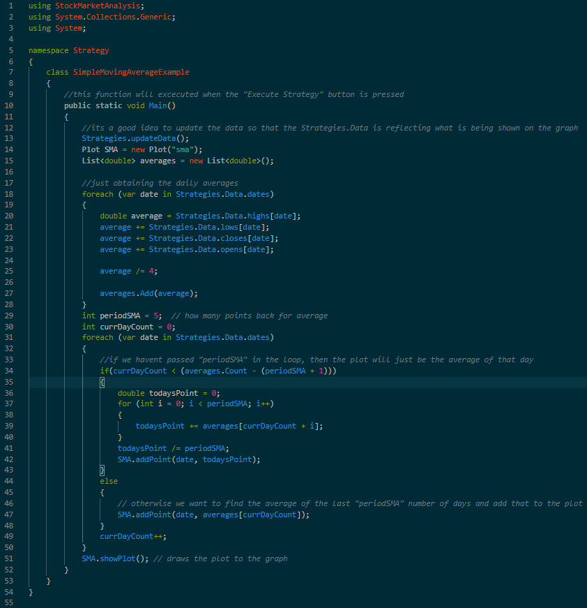
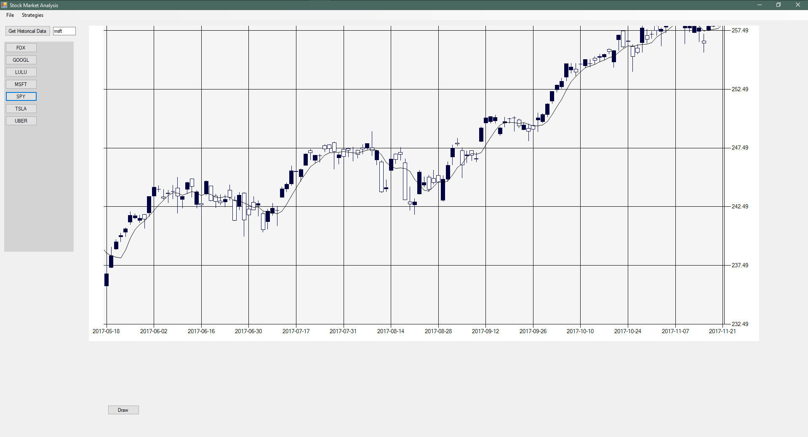

# StockMarketAnalysis
C# tool which allows live stock market data to be fetched via an API and explored. Contains a C# scripting environment which enables the use of user written scripts which can preform deeper analysis
on stock data as desired. 

## Features
 - C# Scripting enviroment with access to stock data and graph to plot on
 - Candle Stick data display with a full range of zoom and pan movement options
 - One click live stock market data fetcher
 - Button interface for switching between different stocks
 - Line mark up tool
 
 
 
### A sample script and it's output on the graph

